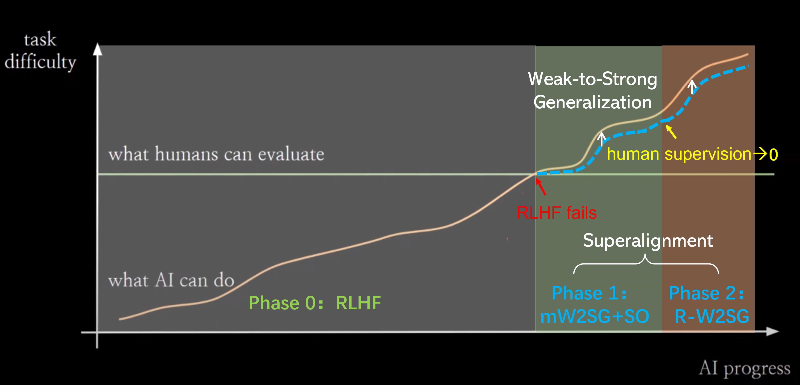

# Improving Weak-to-Strong Generalization with Scalable Oversight and Ensemble Learning


<div align="center">
    <a href="https://arxiv.org/pdf/2402.00667.pdf"></a>
</div>

Our study simulates two phases of superalignment under the W2SG framework: the development of general superhuman models and the progression towards superintelligence. 
In the first phase, based on human supervision, the quality of weak supervision is enhanced through a combination of scalable oversight and ensemble learning, reducing the capability gap between weak teachers and strong students.
In the second phase, an automatic alignment evaluator is employed as the weak supervisor. By recursively updating this auto aligner, the capabilities of the weak teacher models are synchronously enhanced, achieving weak-to-strong supervision
over stronger student models.

<p align="center">
  
</p>

This project contains experimental code for exploring the **first phase** in our paper.

## Get Started
Please prepare the environment and install packages according to the [weak-to-strong](https://github.com/openai/weak-to-strong) project.


## Experimental dataset
The dataset utilized in our study was derived through sampling from the SciQ dataset (see Raw Data [LINK](https://huggingface.co/datasets/sciq) for more details). 
Our constructed dataset can be accessed via the following [LINK](https://drive.google.com/drive/folders/1zLtBuysl17TsAjfMSsjc0B4iAXatslWD?usp=drive_link).


## Acknowledgement
- The open-source project [weak-to-strong](https://github.com/openai/weak-to-strong).
- Hugging Face for their open-source transformer models.

## Citation
```
@misc{sang2024improving,
      title={Improving Weak-to-Strong Generalization with Scalable Oversight and Ensemble Learning}, 
      author={Jitao Sang and Yuhang Wang and Jing Zhang and Yanxu Zhu and Chao Kong and Junhong Ye and Shuyu Wei and Jinlin Xiao},
      year={2024},
      eprint={2402.00667},
      archivePrefix={arXiv},
      primaryClass={cs.CL}
}
```
